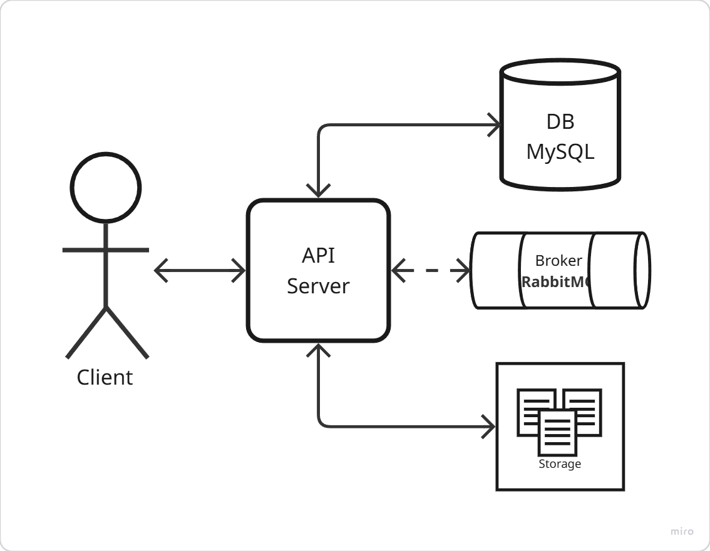
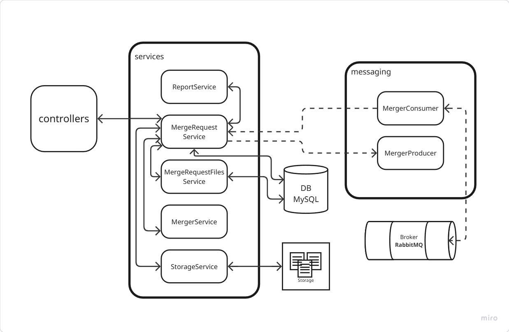
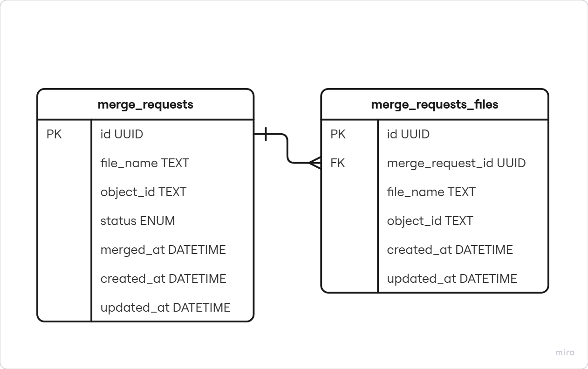

# 📄 Power PDF

## 📌 Sumário

1. [Visão Geral](#-visao-geral)
2. [Tecnologias Utilizadas](#-tecnologias-utilizadas)
3. [Arquitetura](#-arquitetura)
4. [Instalação e Setup](#-instalacao-e-setup)
5. [Coleção Postman](#-colecao-postman)
6. [Documentação da API (Swagger)](#-documentação-da-api-swagger)
7. [Melhorias Futuras](#-melhorias-futuras)

---

## 📘 Visão Geral

Esta aplicação permite ao usuário mesclar múltiplos arquivos PDF através de uma interface construida com Next.js.
O back-end em Spring Boot gerencia os uploads e usa uma fila de mensageria (RabbitMQ/Kafka) para processar a fusão de forma assíncrona e os dados são salvos em um banco de dados relacional, utilizando um storage server para armazenamento dos arquivos.

---

## 🛠 Tecnologias Utilizadas

- **Backend:** Spring Boot 3.5.4 (JAVA 21)
- **Banco de Dados:** MySQL
- **Mensageria:** RabbitMQ
- **Storage:** MinIO
- **API:** RESTful
- **Frontend:** Next.js 15.4.6 (React 19.1.0), Tailwind, [Charts.js](https://www.chartjs.org/), [PDF.js](https://github.com/mozilla/pdf.js)
- **Ambiente:** Docker

---

## 🏧 Arquitetura

- O sistema é desenvolvido utilizando a arquitetura em camadas, com a lógica de negócio centralizada em **services** , promovendo uma melhor separação de responsabilidades e facilitando a manutenção e escalabilidade da aplicação.

### 📌 Visão Geral da Arquitetura

Estrutura macro do sistema, com os principais módulos e sua interação.

<p align="center">
  
</p>

### 🔍 Arquitetura Detalhada

Organização interna das camadas.

<p align="center">
  
</p>

### 🗄️ Diagrama do Banco de Dados

Modelo do banco de dados e suas relações.

<p align="center">
  
</p>

---

## 🚀 Instalação e Setup

- Faça o clone do repositório.
- Certifique-se de que o Docker e o Docker Compose estão instalados.
- Faça o build do projeto:

  ```bash
  docker-compose build
  ```

- Execute o projeto:

  ```bash
  docker-compose up -d
  ```

- Acesse o app:

  ```bash
  http://localhost:3000/
  ```

- Acesse o Relatório:

  ```bash
  http://localhost:3000/report
  ```

---

## 🗋 Documentação da API (Swagger)

Documentação interativa criada.

Acessível via:

  ```bash
  http://localhost:8080/swagger-ui/index.html
  ```

---

## 📬 Coleção Postman

Para facilitar os testes da API, baixe a coleção e importe no [Postman](https://www.postman.com/):

🧾 [Download da coleção](docs/collection.json)

---

## 🔮 Melhorias Futuras

- Implementar paginação na busca dos arquivos mesclados.
- Melhorar o tratamento de erros e exceções.
- Adicionar cache ou uma tabela especifica para os reports em gráficos.
- Permitir que o usuário adicione arquivos na lista sem precisar selecionar todos os arquivos novamente.

---
